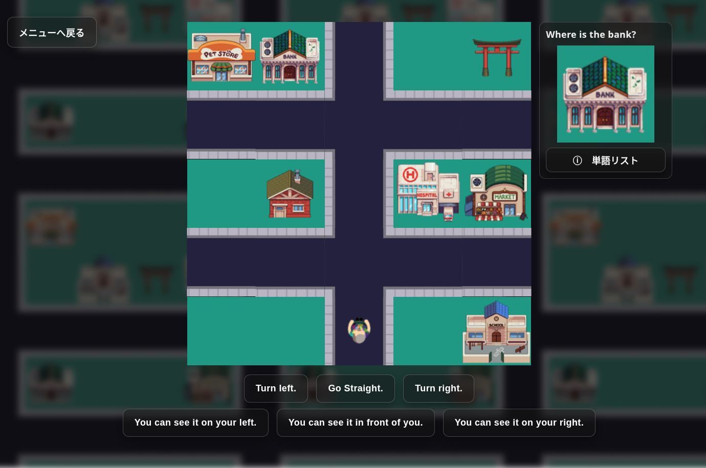

# My Town – 方向を学ぶ英語ゲーム

日本の小学校で英語の教師として働く中で、多くの子どもたちが授業でChromebookを使い、教育ゲームを楽しんでいることに気づきました。
そのとき勉強していた単元にぴったり合った、授業ですぐに使えるシンプルなゲームがあればいいと思い、このプロジェクトを作りました。

実際の授業で使うことを考え、操作がわかりやすく、何度もくり返し練習できる形にしています。

## 概要

My Town は、日本の小学生が英語の方向表現（left, right, straight, front）を練習するために作った、ブラウザゲームです。生徒は、英語のボタンを使って、グリッドマップを移動します。

- **フリーモード** – 教師主導またはペア活動によるスピーキング練習
- **レベルモード** – ソロプレイで、方向ボタンを使って目標の建物まで進むチャレンジモード

次のような実用的な英文パターンをくり返し練習できます。

- “Turn left.”
- “Go straight.”
- “You can see it on your right.”
  🔗 Live Demo: https://charles-hatch.github.io/directions-game/
  

## 主な機能

- さまざまな画面サイズに対応したレスポンシブレイアウト
- ランダムなゴール選択
- アバター選択機能
- 正解時のコンフェッティ（パーティクル）エフェクト
- 英語フレーズを説明する折りたたみ式のLegendボタン

## 使用技術（Tech Stack）

-HTML5
-CSS3
-JavaScript（ES6 Modules）
-Webpack（バンドル）

## 技術構成

このプロジェクトは、The Odin Projectで学んだモジュラー構造をもとに作成しています。
JavaScriptのモジュール分割の基本を意識した設計です。

コードを複数のJavaScriptファイル（モジュール）に分けることで、整理しやすくしています。

メインファイル（index.js）は、他のモジュールと連携して以下を行います。

- ゲームロジックの処理
- 画面へのレンダリング
- ゲームステートの管理
- イベントやボタン操作の検知

ボードロジックでは抽象的なタイルタイプを扱い、レンダラーがそれをビジュアルアセットに変換します。
これにより、ゲームロジックと表示（プレゼンテーション）を分けています。

今後は、追加マップ、専用のキャラクター選択画面、ポイント／レベルシステムの実装を考えています。

## アセットについて

プレイヤーおよび建物画像は https://www.kindpng.com/
の「personal and non-commercial use」ライセンスのもとで使用しています。
タイルアートは Photoshop で作成しました。

---

# My Town – A Directions Game

My Town is a browser-based classroom game designed to help Japanese elementary students practice English directional language (left, right, straight, front).

## Overview

Students navigate a small town grid using English instruction buttons.

- **Free Mode** – Teacher-led or pair-based speaking practice.
- **Level Mode** – Solo Play, with challenges where students navigate to a target building using the directional buttons.

The game teaches these sentences:

- “Turn left.”
- “Go straight.”
- “You can see it on your right.”

As well as vocabulary for building names.

## Features

- Responsive layout for various display sizes
- Randomized goal selection
- Avatar selection
- Confetti particle effect for correct answers
- Collapsible Legend button explaining the English phrases

## Structure

The project follows a modular structure that I studied in The Odin Project, which teaches the fundamentals of JavaScript module separation.
The idea is to split the program into separate JavaScript files (modules) to keep the code organized.

The main file (index.js) interacts with these modules to:

- Handle game logic
- Render content to the screen
- Manage game state
- Listen for events and button presses

For example, the board logic assigns tile types, while the renderer maps those types to visual assets. This keeps game logic independent from the presentation layer.

## Improvements

In future, I would like to include additional maps, a dedicated character selection screen, and a points/level system

## Asset Credits

Player and building images were sourced from [https://www.kindpng.com/](https://www.kindpng.com/) under their "personal and non-commercial use" license. Tile artwork was created in Photoshop.
